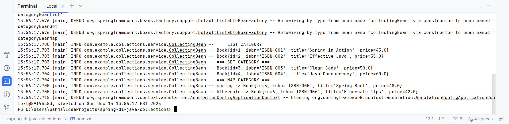
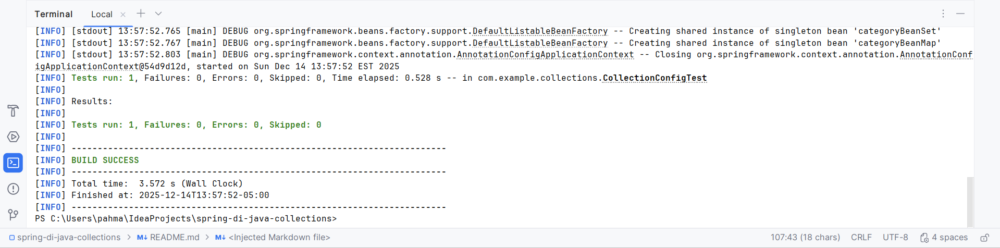
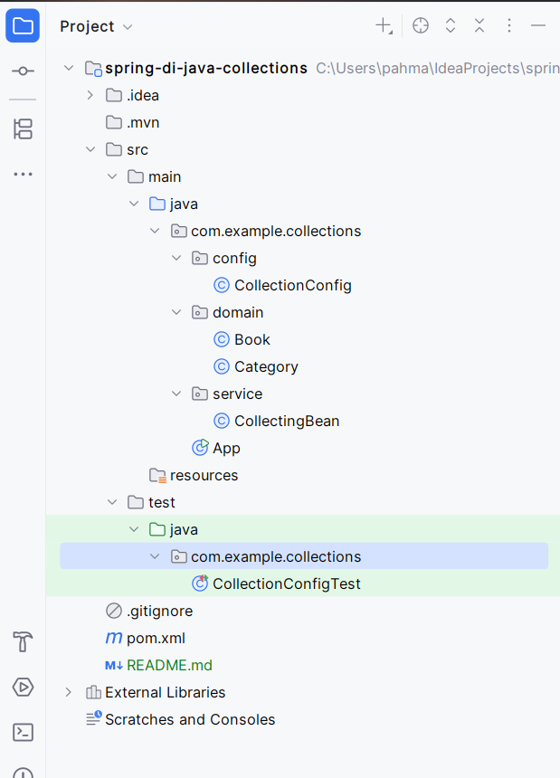

# Spring DI – Java Collections

## Project Name

**spring-di-java-collections**

---

## 📘 Overview

This project demonstrates **Dependency Injection (DI) of Java Collections** using **Spring Framework JavaConfig**.

The application injects and manages:

* `List<Book>`
* `Set<Book>`
* `Map<String, Book>`

into domain objects using **pure Java-based Spring configuration**, without XML.

---

## 🎯 Assignment Objectives

* Use **Spring IoC Container** with JavaConfig
* Inject Java Collections into Spring beans
* Define and wire beans using `@Configuration` and `@Bean`
* Use **SLF4J** for logging output
* Build and run the project using **Maven**
* Create and execute **JUnit 5 tests**

---

## 🧱 Technologies Used

* Java 25
* Spring Framework (Context)
* Maven
* SLF4J + Logback
* JUnit 5

---

## 📁 Project Structure

```
spring-di-java-collections
├── src
│   ├── main
│   │   ├── java
│   │   │   └── com/example/collections
│   │   │       ├── App.java
│   │   │       ├── config
│   │   │       │   └── CollectionConfig.java
│   │   │       ├── domain
│   │   │       │   ├── Book.java
│   │   │       │   └── Category.java
│   │   │       └── service
│   │   │           └── CollectingBean.java
│   └── test
│       └── java
│           └── com/example/collections
│               └── CollectionConfigTest.java
├── pom.xml
└── README.md
```

---

## ▶️ How to Build and Run

### Build the Project

```bash
mvn clean install
```

### Run the Application

```bash
java -jar target/collections.jar
```

---

## 🧪 Running Tests

```bash
mvn clean test
```

The tests verify:

* Spring context loads successfully
* `List`, `Set`, and `Map` collections are injected
* Category beans are properly populated

---

## 📸 Screenshots

### Application Console Output

> Screenshot of the application output after running `java -jar target/collections.jar`



---

### Test Execution Output

> Screenshot of successful test execution using `mvn test`



---

### Project Structure (IDE View)

> Screenshot of the project structure from your IDE (IntelliJ / Eclipse)



---

## ✅ Key Takeaways

* Demonstrates Spring DI with Java Collections
* Uses JavaConfig instead of XML
* Clean separation of concerns (domain, config, service)
* Fully testable and Maven-compliant

---

## 👤 Author

Parsa Ahmadi Nasab Emran

---

## 📄 License

This project is for academic and educational purposes only.
